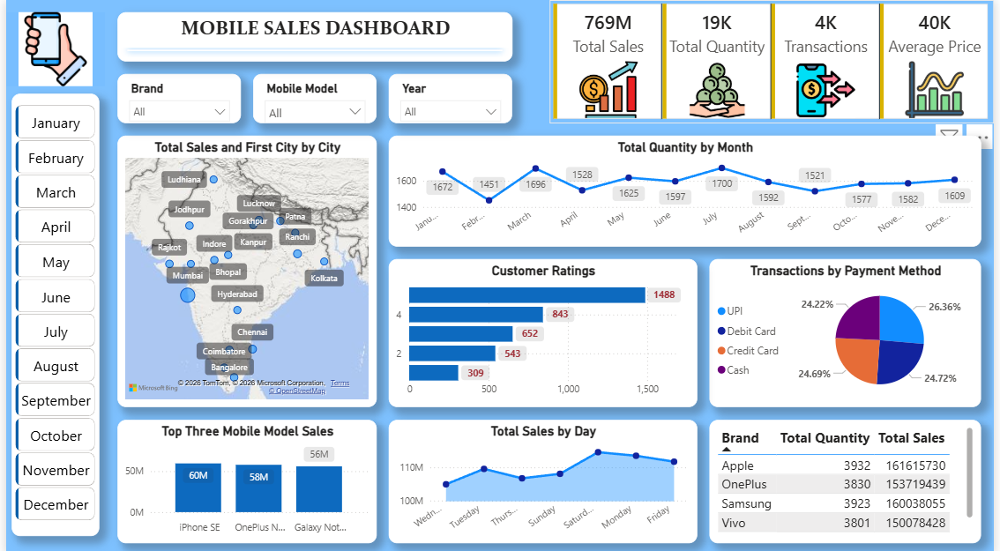

# 📊 Mobile Sales Dashboard | Power BI

> An interactive Power BI dashboard to analyze mobile sales performance, customer behavior, and transaction trends.

---

## 📌 Overview
This project showcases an interactive dashboard built using Power BI to analyze mobile sales data across different cities, brands, and time periods.

It highlights key metrics such as total sales, quantity, transactions, and customer ratings.

---

## 🎯 Purpose
This project was created as part of my learning journey to practice:
- Data visualization
- Dashboard design
- KPI tracking
- Interactive filtering

---

## 📊 Key Highlights
- 💰 Total Sales: **769M**
- 📦 Total Quantity: **19K**
- 💳 Transactions: **4K**
- 📈 Average Price: **40K**

---

## 📈 Insights
- 📍 Sales are distributed across multiple cities with strong presence in metro areas  
- 📅 Monthly trends show fluctuations with peak sales in certain months  
- ⭐ Majority customer ratings fall in higher rating categories  
- 💳 UPI and card payments dominate transaction methods  
- 📱 Top mobile models contribute significantly to overall revenue  

---

## 📸 Dashboard Preview

---

## 📁 Project Files
- 📊 [Download Dashboard (.pbix)](Mobile_Sales_Dashboard.pbix)
- 📂 [Dataset](Mobile_Sales_Data.xlsx)

---

## 🛠 Tech Stack
- Power BI (Power Query, DAX, Visualization)
- Excel (Raw Data)
---
## 🧹 Data Preparation (Power Query)
- Cleaned and transformed raw data using Power Query  
- Handled missing values and ensured correct data types  
- Created structured dataset for analysis  
---
## 🖥️ How to Use
1. Download the `.pbix` file  
2. Open in Power BI Desktop  
3. Explore using filters (Month, Brand, Model, Year)  

---

## 👤 Author
**Saniya Siddiquie**  
🔗 GitHub: https://github.com/saniyasiddiqui7  
🔗 LinkedIn: https://www.linkedin.com/in/saniya-siddique  

---
---

⭐ If you found this project useful or insightful, feel free to give it a star and connect with me!
